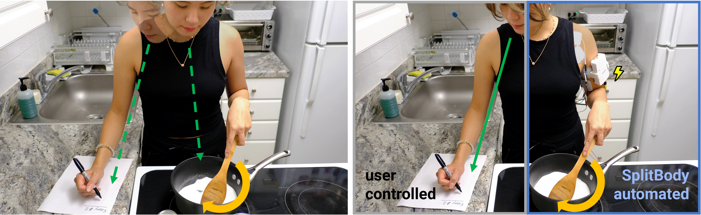

# SplitBody: Reducing Mental Workload while Multitasking via Muscle Stimulation

This is the repository for the study code used for "SplitBody: Reducing Mental Workload while Multitasking via Muscle Stimulation" paper (ACM CHI2024) by Romain Nith, Yun Ho and Pedro Lopes.

For more information, please refer to our paper: http://lab.plopes.org/#SplitBody

# software

The main python `dual_task_pattern-n-back` is at the core of the study code. It runs a predefined 2-back sequence, controls the muscle stimulation, and logs all data into `.csv` files. The script also communicates with Unity3D via OSC to start/stop logging positional data from the Vive tracker. 

The Unity3D project is installed by creating a new project and importing the `study_nback.unitypackage`. This project logs the Vive tracker raw data.

More information about the study procedure can be found in the paper.

## version requirements

Below are the recommended software and library versions

- python = 3.9.15
- pygame = 2.1.3
- python-osc = 1.8.0
- Unity = 2021.3.4f1

# hardware requirements
- Hasomed RehaStim 1 muscle stimulator
- HTC Vive tracking system (using only one Vive tracker)

# study setup

# citing
When using or building upon this code in an academic publication, please consider citing as follows:

Romain Nith, Yun Ho, and Pedro Lopes. 2024. SplitBody: Reducing Mental Workload while Multitasking via Muscle Stimulation. In Proceedings of the CHI Conference on Human Factors in Computing Systems (CHI '24). Association for Computing Machinery, New York, NY, USA, Article 81, 1–11. https://doi.org/10.1145/3613904.3642629

# contact
For any questions about this repository, please contact rnith@uchicago.edu
